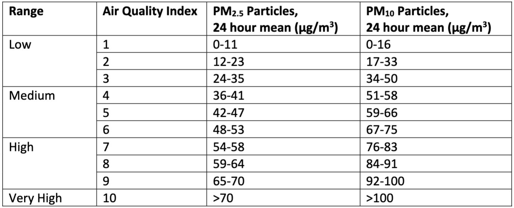

# Cloud-Computing

This project implements a system for collecting, processing, and distributing IoT sensor data to calculate and provide Air Quality Index (AQI) information using Amazon Web Services (AWS).

### Project Tasks and Goals
The main objectives of this project are:

1. Collect environmental sensor data from online sources and store it in a cloud-based database.
2. Implement a mechanism to update the database with new data as it becomes available.
3. Calculate the Air Quality Index (AQI) for each database entry based on provided criteria.
4. Develop a front-end implementation for data distribution to clients on demand:

- Allow clients to download data based on user-specified criteria (e.g., geographical location, time frame).
- Simulate increasing workloads by increasing the number of client requests.
- Measure system workload to determine the need for new worker nodes.
- Implement an elastic solution that increases the number of worker nodes as workload increases.
- Analyze cost implications of instantiating new worker nodes and determine optimal scaling points.

5. Address data security and sovereignty implications, particularly for sensitive data fields.

Key Considerations:

- Determine the most efficient and cost-effective point for AQI calculation (bulk download vs. client request).
- Implement appropriate workload measurement metrics.
- Optimize the balance between system performance and cost in the elastic scaling solution.

### Features

- Fetches real-time sensor data from IoT devices
- Calculates AQI based on PM2.5 and PM10 values
- Stores processed data in AWS DynamoDB
- Provides a web interface for AQI lookup
- Utilizes AWS services for scalable and efficient data processing and storage

### Architecture
The system utilizes the following AWS services:

- EC2: Hosts the main data processing script
- DynamoDB: Stores the processed AQI data
- Lambda: Handles database updates and API requests
- API Gateway: Manages the REST API for the web interface
- S3: Hosts the static web files
- CloudWatch: Monitors system performance
- VPC: Ensures network isolation and security

There are many limitations when implementing the project because of permission issues.
